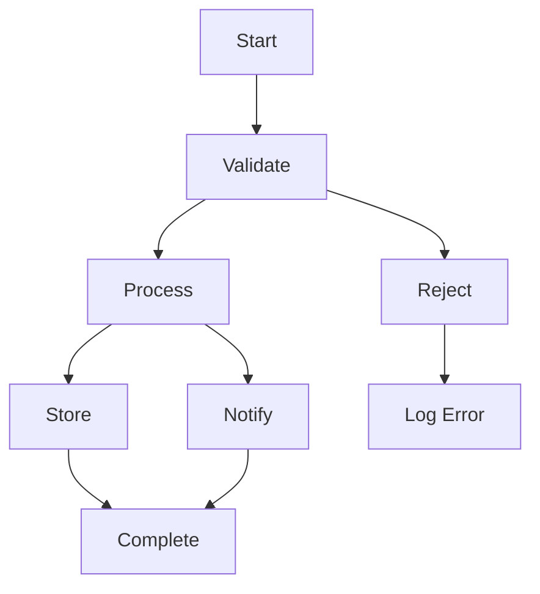

# Constraint Language Specification

Version: 1
Status: Draft

## Overview

Layout constraints are embedded in mermaid diagram text as a structured comment block. They are invisible to non-aware renderers and human-readable.

## Block Format

```
%% @layout-constraints v1
%% <constraint-line>
%% <constraint-line>
%% ...
%% @end-layout-constraints
```

The block can appear anywhere in the mermaid text (typically at the end). Only one block per diagram. If multiple blocks are present, only the first is parsed.

### Why comment blocks?

| Approach | Verdict | Reason |
|----------|---------|--------|
| YAML frontmatter (`---`) | ❌ | Already used by mermaid for config; collision risk |
| Directives (`%%{ }%%`) | ❌ | Parsed by mermaid, could interfere; single-line only |
| Comment block (`%%`) | ✅ | Completely ignored by all mermaid parsers; multi-line; `@layout-constraints` sentinel is unambiguous |

## Node Identifiers

Node IDs match the IDs used in the mermaid diagram. Examples:
- Simple: `A`, `B`, `myNode`
- With spaces: quoted in mermaid as `A["My Node"]`, referenced in constraints as `A`
- The constraint system uses the **short ID** (the identifier before the label), not the label text

## Edge Identifiers

Edges are identified by their source and target node IDs plus arrow style:

```
A-->B       # standard arrow
A---B       # line (no arrow)
A-.->B      # dotted arrow
A==>B       # thick arrow
A--text-->B  # labeled arrow (label not part of edge ID in constraints)
```

In the constraint block, edge IDs are written as `A-->B` (source, arrow, target). For labeled edges, omit the label: the edge `A--"yes"-->B` is referenced as `A-->B`.

If multiple edges exist between the same pair of nodes, they are disambiguated by order of appearance (this is a known limitation — may need indexing syntax in v2).

## Constraint Types

### Directional Offsets

Place a node at a specific distance in a cardinal direction from another node. Distance is center-to-center in pixels.

```
%% A south-of B, 120
%% A north-of B, 80
%% A east-of B, 100
%% A west-of B, 60
```

**Semantics:**
- `A south-of B, d` → `A.centerY = B.centerY + d`
- `A north-of B, d` → `A.centerY = B.centerY - d`
- `A east-of B, d` → `A.centerX = B.centerX + d`
- `A west-of B, d` → `A.centerX = B.centerX - d`

The first node (`A`) is the one that moves. The second node (`B`) is the reference.

**Distance is required.** To express "A is somewhere south of B" without a fixed distance, use alignment instead or omit and let the base layout decide.

### Alignment

Align two nodes on an axis.

```
%% align A, B, h
%% align A, B, v
```

**Semantics:**
- `align A, B, h` → `A.centerY = B.centerY` (horizontal alignment = same vertical position)
- `align A, B, v` → `A.centerX = B.centerX` (vertical alignment = same horizontal position)

**Which node moves?** The node that displaced less from its base layout position. If both are equally displaced, average.

**Multi-node alignment:**
```
%% align A, B, C, h
```
All listed nodes share the same Y coordinate (averaged from base positions).

### Group

Treat nodes as a layout unit.

```
%% group A, B, C as processing
```

**Semantics:**
- Nodes in a group maintain their relative positions to each other
- When any group member is referenced by an external constraint (alignment, offset), the entire group moves as a unit
- Groups are logical — no visual border (unlike mermaid subgraphs)
- A node can belong to multiple groups (nested grouping)
- The group name (`processing`) is for human readability and must be unique

### Anchor

Pin a node to absolute coordinates.

```
%% anchor A, 200, 300
```

**Semantics:**
- `A.centerX = 200`, `A.centerY = 300`
- Highest priority — overrides all other constraints on the anchored axes
- If a node is anchored and also aligned with another node, the anchor wins and the other node moves to match (if the alignment constraint has lower priority)

### Waypoints

Create a zero-size shadow node on an edge.

```
%% waypoint A-->B as wp1
```

**Semantics:**
- Creates a shadow node `wp1` at the midpoint of edge `A-->B`
- The edge is re-routed: source → wp1 → target
- `wp1` can then be constrained like any other node:

```
%% wp1 west-of C, 20
%% align wp1, D, h
%% anchor wp1, 150, 200
```

**Multiple waypoints on one edge:**
```
%% waypoint A-->B as wp1
%% waypoint A-->B as wp2
```
Waypoints are ordered by declaration sequence. Edge routes: A → wp1 → wp2 → B.

**Waypoint constraints follow all the same rules as node constraints** — directional offsets, alignment, grouping, anchoring. The only difference: waypoints have zero width/height and cannot be connection endpoints.

## Grammar (Formal)

```ebnf
constraint_block  = "%% @layout-constraints v" VERSION NEWLINE
                    { constraint_line NEWLINE }
                    "%% @end-layout-constraints"

constraint_line   = "%%" SP constraint_expr

constraint_expr   = directional_expr
                  | align_expr
                  | group_expr
                  | anchor_expr
                  | waypoint_decl_expr

directional_expr  = NODE_ID SP DIRECTION SP NODE_ID "," SP NUMBER
DIRECTION         = "north-of" | "south-of" | "east-of" | "west-of"

align_expr        = "align" SP node_list "," SP AXIS
AXIS              = "h" | "v"
node_list         = NODE_ID { "," SP NODE_ID }

group_expr        = "group" SP node_list SP "as" SP GROUP_NAME

anchor_expr       = "anchor" SP NODE_ID "," SP NUMBER "," SP NUMBER

waypoint_decl_expr = "waypoint" SP EDGE_ID SP "as" SP WP_ID

EDGE_ID           = NODE_ID ARROW NODE_ID
ARROW             = "-->" | "---" | "==>" | "-.->" | "--"
NODE_ID           = [a-zA-Z0-9_]+
WP_ID             = [a-zA-Z0-9_]+
GROUP_NAME        = [a-zA-Z0-9_]+
NUMBER            = [0-9]+
VERSION           = "1"
SP                = " "
```

Note: Once a waypoint is declared via `waypoint_decl_expr`, its `WP_ID` becomes a valid `NODE_ID` for use in subsequent `directional_expr` and `align_expr` constraints.

## Complete Example



## Constraint Priority

When constraints conflict (e.g., both try to set the same axis of the same node):

1. **anchor** (absolute position)
2. **group** (group membership / bounding box)
3. **align** (axis alignment)
4. **directional offset** (north/south/east/west-of)

Higher priority wins. Equal priority on same axis → average the target positions.

## Compatibility Rules

| Constraint A | Constraint B | Compatible? | Notes |
|-------------|-------------|-------------|-------|
| `align A, B, h` | `align A, C, v` | ✅ | Different axes |
| `align A, B, h` | `A east-of B, 100` | ✅ | h constrains Y, east-of constrains X |
| `align A, B, h` | `A south-of B, 120` | ❌ | Both constrain Y; south-of dropped |
| `anchor A, ...` | anything on A | ❌ | Anchor wins on anchored axes |
| `group ...` | `align ...` | ✅ | Group moves as unit, then aligns |
| waypoint constraint | any node constraint | ✅ | Same rules apply |

## Versioning

The `v1` in `@layout-constraints v1` allows future grammar evolution. Parsers should reject unknown versions with a warning (not an error — just skip the block).
