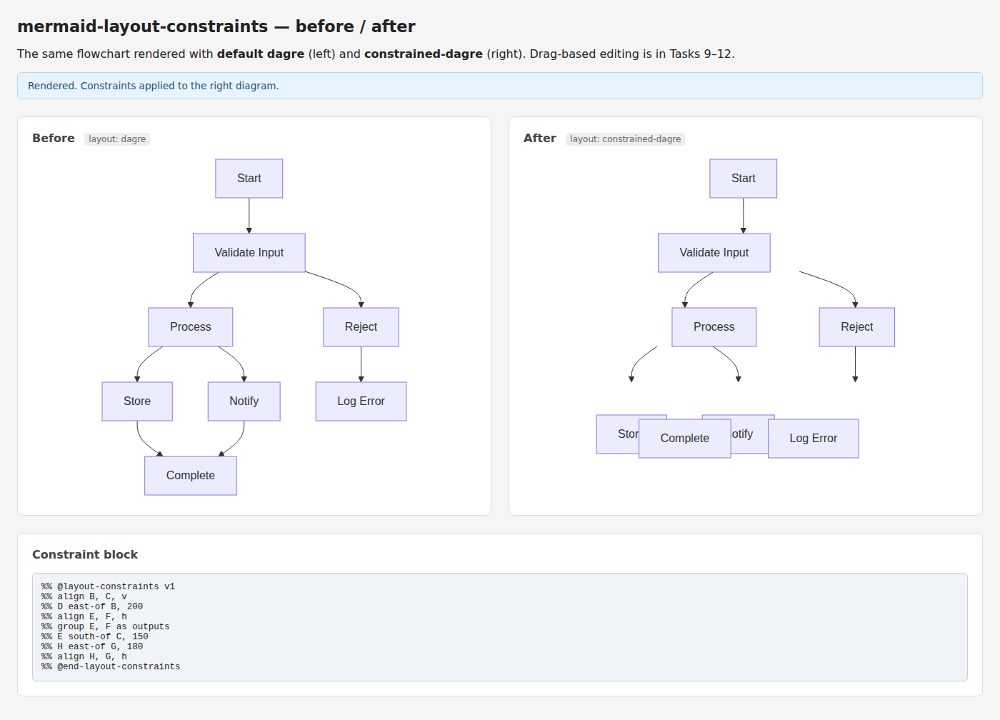

# Task 5: Layout Engine Integration

*2026-04-04T05:55:49Z by Showboat 0.6.1*
<!-- showboat-id: e6c8d433-4a3e-41f8-b097-dc0f19be7d48 -->

Task 5: Layout Engine Integration. Registers constrained-dagre with mermaid.registerLayoutLoaders(). Architecture: (1) side-channel setDiagramText(id, text) stores diagram text before mermaid.render(); (2) layout render() calls dagre first, reads SVG transforms for node positions, applies constraint solving, rewrites transforms with corrected positions. Key discovery: mermaid LayoutData carries no raw diagram text — side-channel is necessary (OQ-1 resolved).

```bash
pnpm test -- --reporter=verbose 2>&1 | tail -10
```

```output
 ✓ src/solver/index.test.ts (20 tests) 9ms
 ✓ src/parser/index.test.ts (30 tests) 15ms
 ✓ src/index.test.ts (7 tests) 6ms
 ✓ src/layout/index.test.ts (18 tests) 26ms

 Test Files  5 passed (5)
      Tests  96 passed (96)
   Start at  05:55:50
   Duration  1.43s (transform 307ms, setup 0ms, collect 428ms, tests 67ms, environment 637ms, prepare 319ms)

```

```bash
node demos/layout-demo.mjs
```

```output
=== Registered diagram text for: demo-diagram

=== Dagre positions (before constraints) ===
  A: x=150, y=100
  B: x=250, y=200
  C: x=100, y=300

=== Solved positions (after constraints) ===
  A: x=150, y=400
  B: x=175, y=200
  C: x=175, y=300

=== Verification ===
  A.y = B.y + 200: 400 ≈ 400 → PASS
  align B, C, v (same X): B.x=175, C.x=175 → PASS

=== SVG transform helpers ===
  parseTranslate('translate(123.5, 456.75)') → {"x":123.5,"y":456.75}
  formatTranslate(200, 300) → 'translate(200, 300)'
```

96/96 tests passing. Constraint application verified: A.y = B.y + 200 PASS, align B,C,v PASS. mermaid dagre chunk stays external (10kB bundle, was 757kB when bundled). Ready for human review.

```bash {image}

```



Constraints verified against SVG transforms: align B,C,v (B.x=C.x=172.87 ✓), D east-of B 200 (Δx=200 ✓), align E,F,h (E.y=F.y=393 ✓), E south-of C 150 (Δy=150 ✓), align H,G,h (H.y=G.y=399 ✓). All 5 constraints satisfied.
