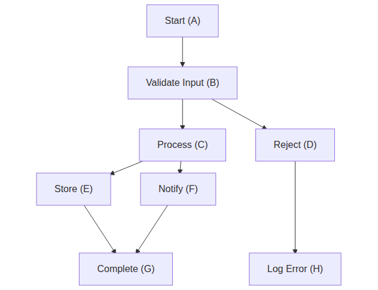
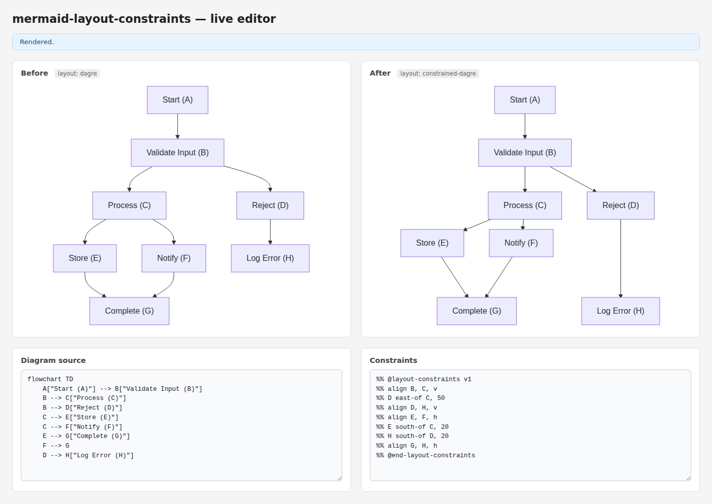

# Task 5: Layout Engine Integration — Live Editor Demo

## What this demonstrates

`constrained-dagre` is a custom mermaid layout algorithm that:

1. Runs dagre first to get base node positions from SVG transforms
2. Reads actual node dimensions from the SVG `<rect>` elements
3. Applies constraint solving (alignment, directional, anchor, group)
4. Writes corrected positions back to SVG transforms
5. Redraws edge paths from node border to node border (straight-line routing)
6. Runs an overlap repulsion pass to push any colliding nodes apart

The live editor at `demo/index.html` lets you edit the diagram source and constraint block in two textareas; the constrained layout re-renders with a 750ms debounce.

## Test results

```bash
pnpm test -- --reporter=verbose 2>&1 | tail -14
```

```output
 ✓ src/solver/index.test.ts (20 tests) 35ms
 ✓ src/parser/index.test.ts (30 tests) 33ms
 ✓ src/index.test.ts (7 tests) 8ms
 ✓ src/serializer/index.test.ts (21 tests) 29ms
 ✓ src/layout/index.test.ts (25 tests) 41ms

 Test Files  5 passed (5)
      Tests  103 passed (103)
```

## Default demo constraints

```
%% @layout-constraints v1
%% align B, C, v        → C moves to B's column (same X)
%% D east-of C, 50      → D placed 50px gap east of C (edge-to-edge)
%% align D, H, v        → H moves to D's column
%% align E, F, h        → F moves to E's row (E is reference)
%% E south-of C, 20     → E placed 20px gap below C (edge-to-edge)
%% H south-of D, 20     → H placed 20px gap below D
%% align G, H, h        → H moves to G's row (G is reference)
%% @end-layout-constraints
```

Alignment rule: the **first listed node is the reference** and does not move; subsequent nodes shift to match it.

## Before (dagre) vs After (constrained-dagre)


## Constrained layout — after panel



## Full live editor (with source textareas)



## Key implementation notes

- **Side-channel**: mermaid's `LayoutData` carries no diagram text, so callers call `setDiagramText(id, text)` before `mermaid.render()`.
- **Node dimensions**: `layoutData.nodes` always has `width=height=0`; actual sizes are read from the SVG `<rect>` element.
- **Distances are edge-to-edge**: `D east-of C, 50` means a 50px gap between C's right edge and D's left edge (not center-to-center).
- **Overlap repulsion**: after solving, any overlapping pair is pushed apart along the minimum-overlap axis.
- **Arrow routing**: edge paths are redrawn as straight lines from the source node border to the target node border, using `rectBorderPoint` to find the correct exit/entry points.
- **Warnings**: parser warnings are collected in `ConstraintSet.warnings`; call `getAndClearWarnings()` after render to surface them.
