# Task 5: Layout Engine Integration — Live Editor Demo

## What this demonstrates

`constrained-dagre` is a custom mermaid layout algorithm that:

1. Runs stock dagre to get base node positions from SVG transforms
2. Reads actual node dimensions from SVG `<rect>` elements (mermaid's `layoutData.nodes` always has `width=height=0`)
3. Applies constraint solving: alignment (first-is-anchor), directional (edge-to-edge), anchor, group
4. Writes corrected transforms back to the SVG
5. Redraws edge paths as straight border-to-border lines using `rectBorderPoint`
6. Runs an overlap repulsion pass — **no two nodes are ever allowed to overlap**
7. Surfaces parser warnings via `getAndClearWarnings()` into the page status bar

The live editor at `demo/index.html` renders both dagre (before) and constrained-dagre (after) side-by-side, with 750ms-debounced textareas for live editing of diagram source and constraints.

---

## Test results

```
pnpm test
```

```
 ✓ src/solver/index.test.ts (20 tests)
 ✓ src/parser/index.test.ts (30 tests)
 ✓ src/serializer/index.test.ts (21 tests)
 ✓ src/index.test.ts (7 tests)
 ✓ src/layout/index.test.ts (25 tests)

 Test Files  5 passed (5)
      Tests  103 passed (103)
```

---

## Scenario 1 — Default constraints: before/after side by side

**Diagram source:**
```
flowchart TD
    A[Start] --> B[Validate]
    B --> C[Process]
    B --> D[Reject]
    C --> E[Store]
    C --> F[Notify]
    E --> G[Complete]
    F --> G
    D --> H[Log Error]
```

**Constraints:**
```
%% @layout-constraints v1
%% align B, C, v
%% D east-of C, 50
%% align D, H, v
%% align E, F, h
%% E south-of C, 20
%% H south-of D, 20
%% align G, H, h
%% @end-layout-constraints
```

Constraints applied:
```
align B, C, v       → C moves to B's column
D east-of C, 50     → D placed 50px edge-to-edge east of C
align D, H, v       → H moves to D's column
align E, F, h       → F moves to E's row (E is reference/anchor)
E south-of C, 20    → E placed 20px edge-to-edge below C
H south-of D, 20    → H placed 20px edge-to-edge below D
align G, H, h       → H moves to G's row (G is reference/anchor)
```

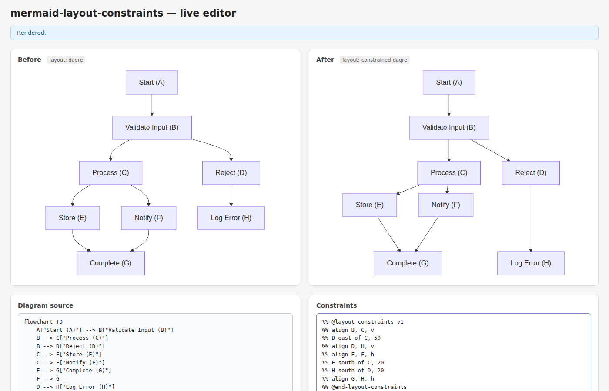

---

## Scenario 2 — Default constraints: constrained layout (after panel)

Same diagram and constraints as Scenario 1.

No overlaps. D is right of C. E/F row-aligned. G/H row-aligned.

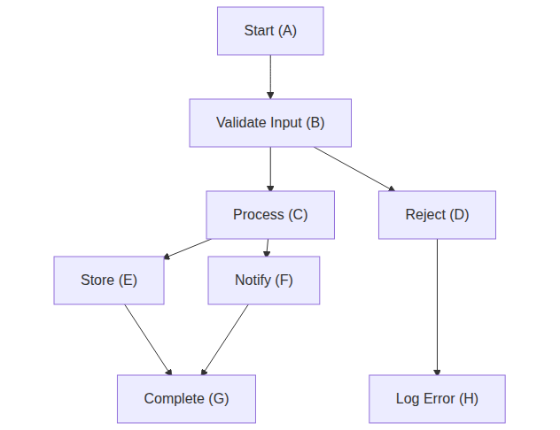

---

## Scenario 3 — Dagre baseline (before panel)

Same diagram source as Scenario 1. No constraints applied.

Stock dagre layout — no constraints applied.

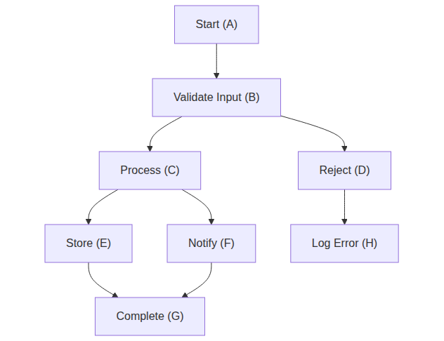

---

## Scenario 4 — `align B, D, h`: first-is-anchor rule

**Diagram source:** same as Scenario 1.

**Constraints:**
```
%% @layout-constraints v1
%% align B, D, h
%% @end-layout-constraints
```

B is listed first → B is the reference. D moves **up** to B's row.
Overlap repulsion then pushes B and D apart horizontally (they would otherwise collide).

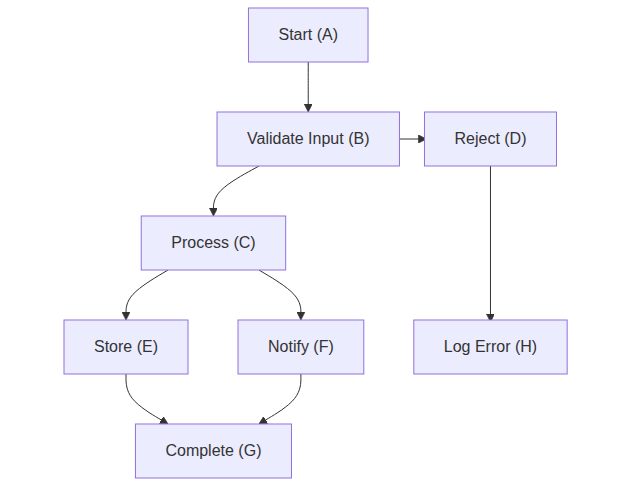

---

## Scenario 5 — `align G, H, h`: second node follows first

**Diagram source:** same as Scenario 1.

**Constraints:**
```
%% @layout-constraints v1
%% align G, H, h
%% @end-layout-constraints
```

G is listed first → G is the reference. H moves **down** to G's row.

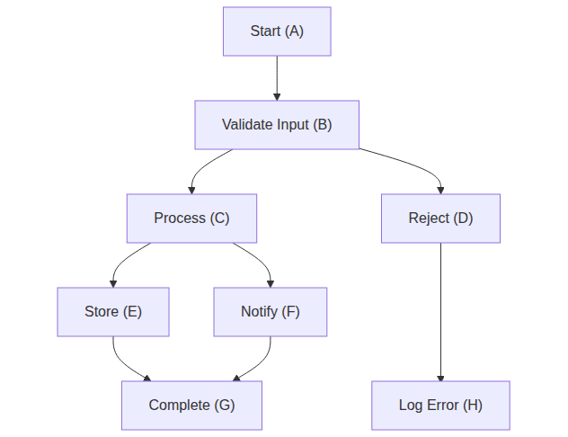

---

## Scenario 6 — `align B, C, v`: vertical alignment (same column)

**Diagram source:** same as Scenario 1.

**Constraints:**
```
%% @layout-constraints v1
%% align B, C, v
%% @end-layout-constraints
```

B is first → reference. C shifts left to B's x-center.

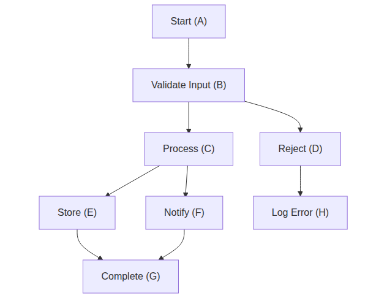

---

## Scenario 7 — `D east-of C, 50`: directional, edge-to-edge

**Diagram source:** same as Scenario 1.

**Constraints:**
```
%% @layout-constraints v1
%% D east-of C, 50
%% @end-layout-constraints
```

50px gap between C's right edge and D's left edge (not center-to-center).

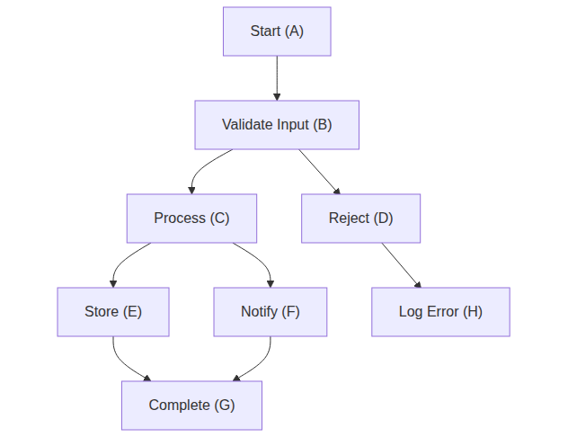

---

## Scenario 8 — `E south-of C, 20`: directional, edge-to-edge

**Diagram source:** same as Scenario 1.

**Constraints:**
```
%% @layout-constraints v1
%% E south-of C, 20
%% @end-layout-constraints
```

20px gap between C's bottom edge and E's top edge.

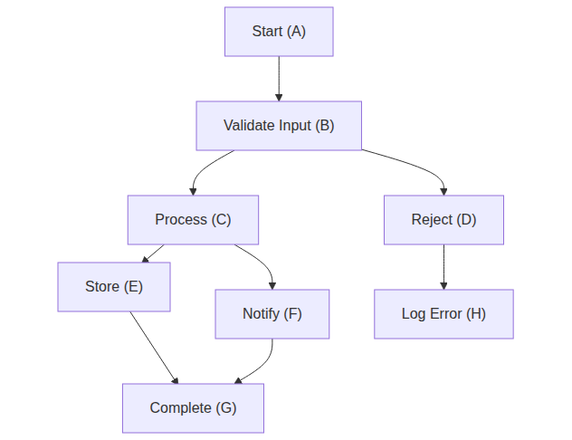

---

## Scenario 9 — Overlap repulsion with dual h-alignment

**Diagram source:** same as Scenario 1.

**Constraints:**
```
%% @layout-constraints v1
%% align B, D, h
%% align G, H, h
%% @end-layout-constraints
```

`align B, D, h` pulls D up to B's row; `align G, H, h` pulls H down to G's row.
B and D are now at the same Y — repulsion pushes them apart horizontally. No overlap.

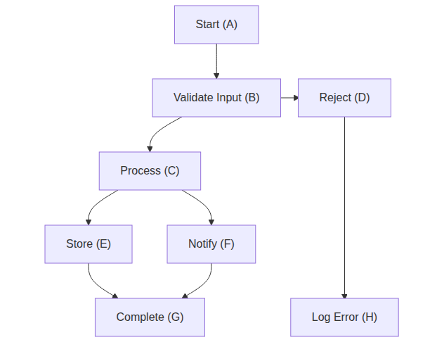

---

## Scenario 10 — Warning surfaced in status bar

**Diagram source:** same as Scenario 1.

**Constraints:**
```
%% @layout-constraints v1
%% align B, C, v
%% this is not a valid constraint
%% @end-layout-constraints
```

Malformed constraint line is skipped; warning appears in the yellow status bar.

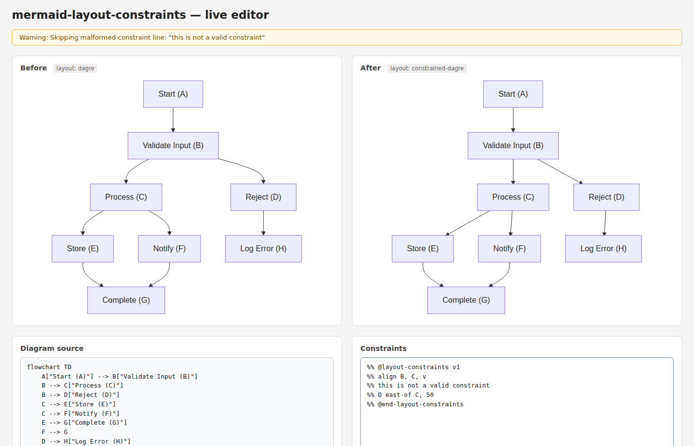

---

## Scenario 11 — Full live editor

**Diagram source:** same as Scenario 1.

**Constraints:** same as Scenario 1 (default constraints).

Both textareas visible; diagram and constraints are editable; re-renders on input with 750ms debounce.

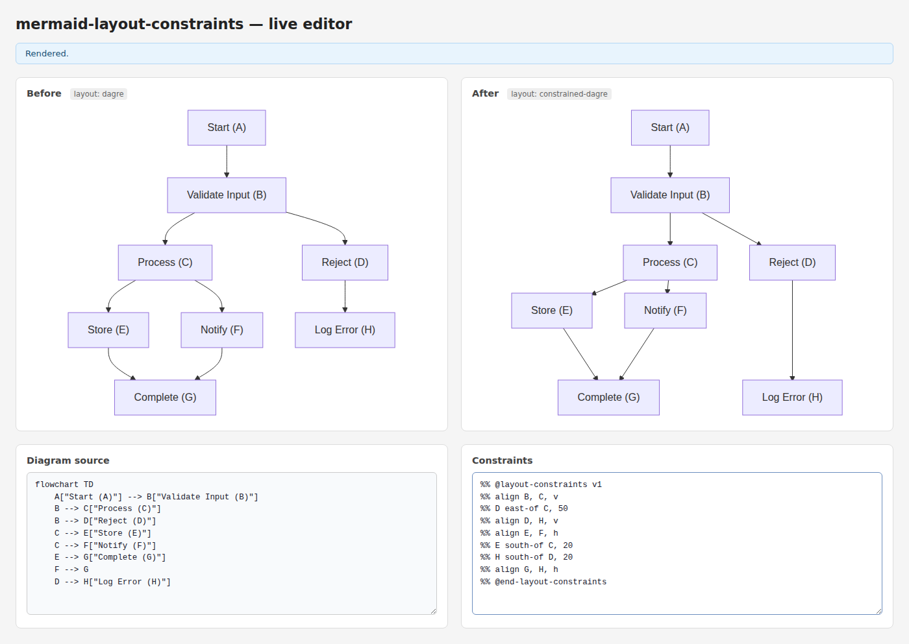

---

## Key implementation facts

| Property | Value |
|---|---|
| Alignment rule | First node listed = reference (does not move); others shift to it |
| Distance semantics | Edge-to-edge (not center-to-center) |
| No-overlap guarantee | `resolveAllOverlaps` repulsion pass runs after every solve |
| Arrow routing | `rectBorderPoint` straight-line routing from node border to node border |
| Node dimensions | Read from SVG `<rect>` (layoutData always gives 0) |
| Warning API | `getAndClearWarnings()` after `mermaid.render()` |
