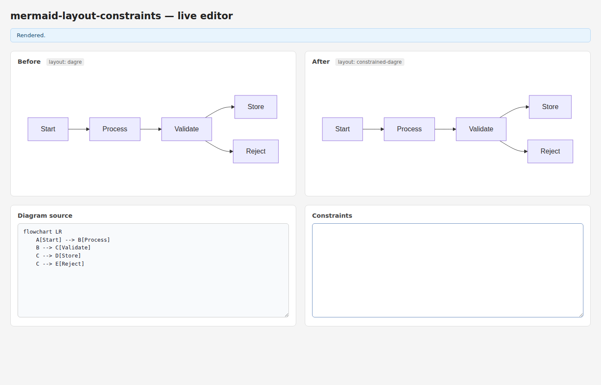
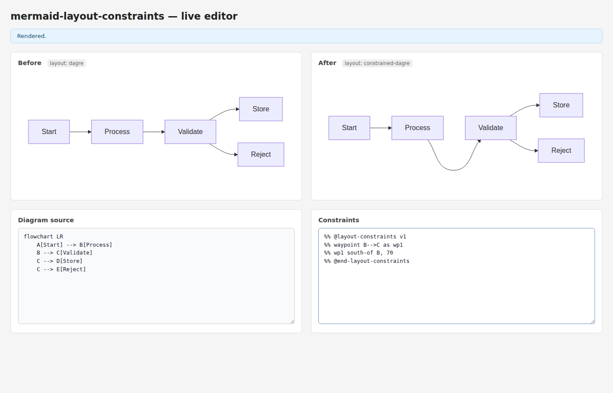
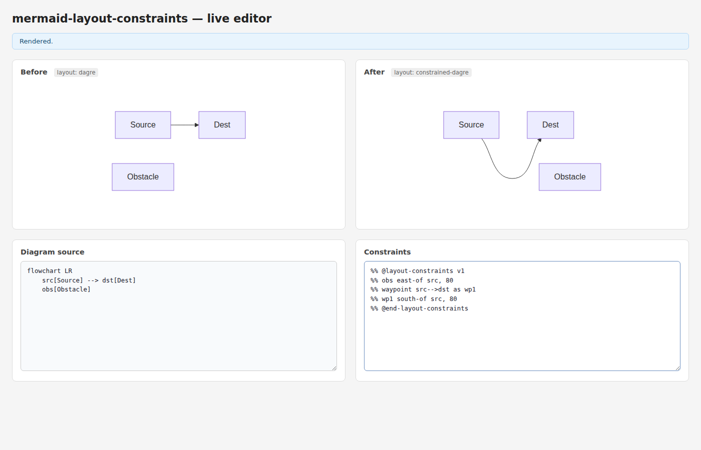
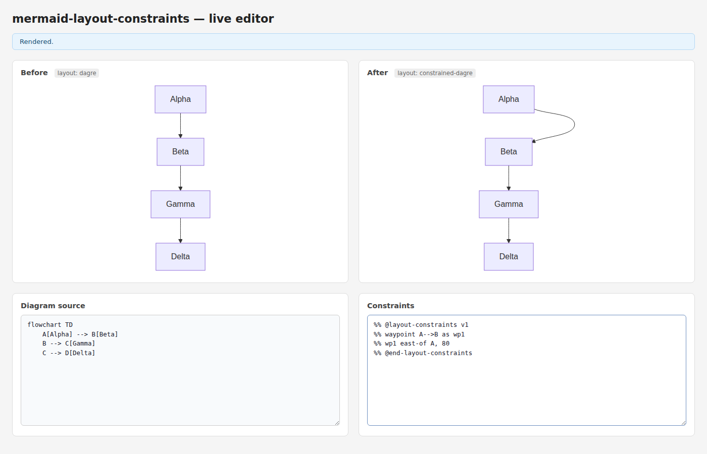
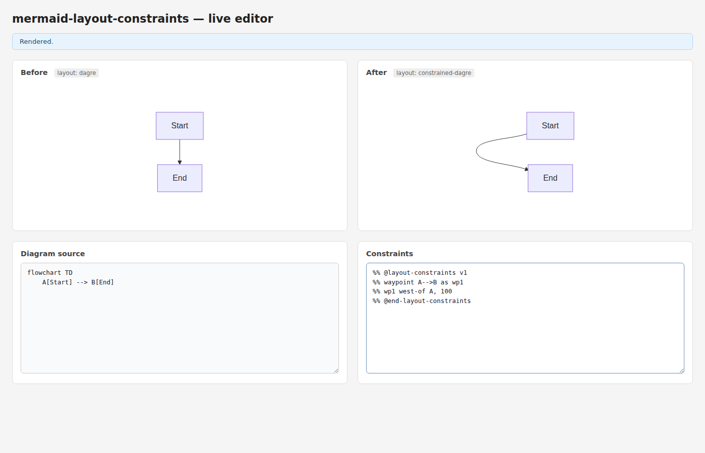
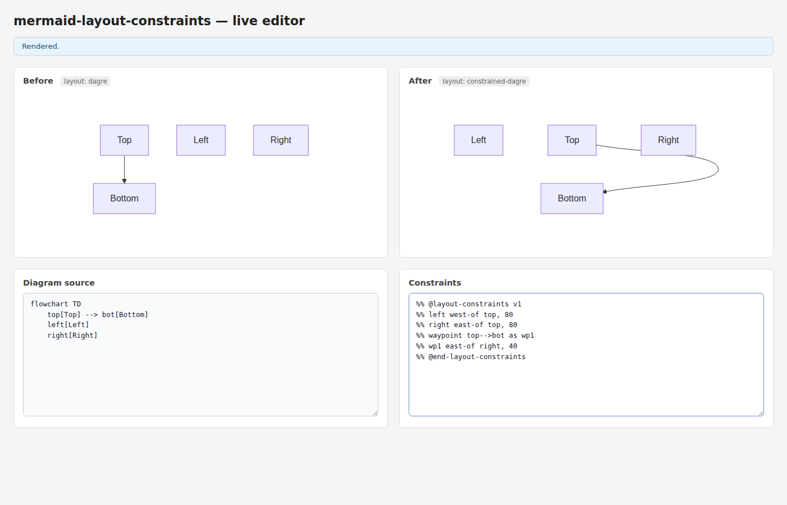
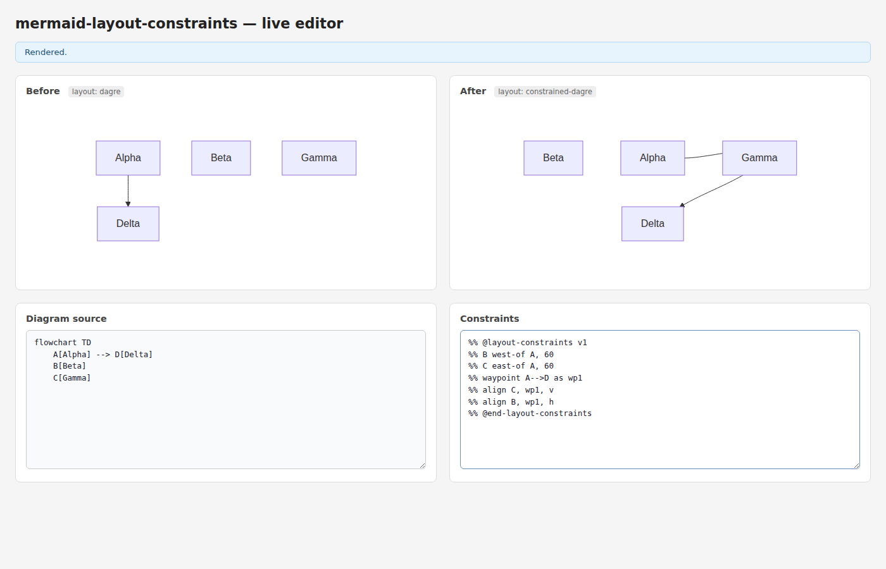
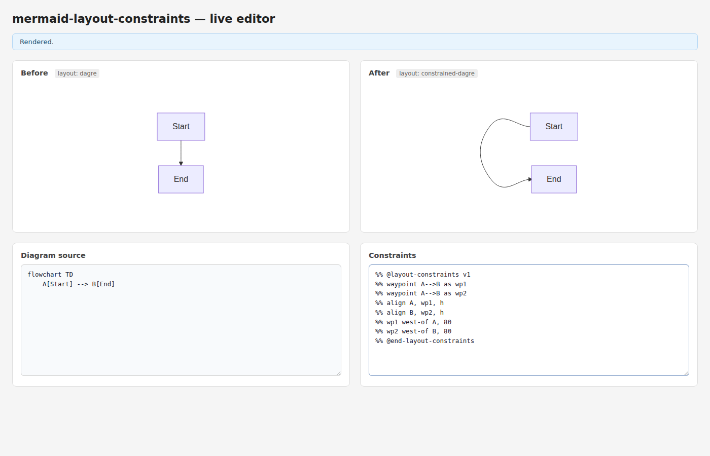

# Task 6: Edge Router — Waypoint-based edge routing

*2026-04-05T22:56:39Z by Showboat 0.6.1*
<!-- showboat-id: be546f1d-165c-4d19-93f8-3a34393c047e -->

Implements waypoint shadow nodes that route edges through constrained intermediate positions. Syntax: `waypoint A-->B as wp1` declares a zero-size shadow node on an edge. The waypoint ID becomes a regular constraint target: `wp1 south-of B, 60` routes the edge through a position below B. Multiple waypoints per edge are supported, ordered by parse order.

Implementation: (1) `buildWaypointNodes` injects zero-size LayoutNodes at the edge midpoint as initial positions. (2) `solveConstraints` positions waypoints via the normal constraint system. (3) `routeEdgesWithWaypoints` builds a catmull-rom spline (tension=1/3) through exitPt → wp1 → ... → adjustedEntry. Edge labels are repositioned to the new geometric midpoint.

```bash
pnpm test -- --reporter=verbose 2>&1 | tail -15
```

```output
 ✓ src/parser/index.test.ts (33 tests) 25ms
 ✓ src/solver/index.test.ts (22 tests) 41ms
 ✓ src/serializer/index.test.ts (21 tests) 10ms
 ✓ src/index.test.ts (7 tests) 13ms
 ✓ src/layout/index.test.ts (39 tests) 57ms

 Test Files  5 passed (5)
      Tests  122 passed (122)
   Duration  1.37s
```

---

## Scenario 1 — Baseline: no waypoints (dagre default routing)

No constraints. Dagre routes the edge directly.



---

## Scenario 2 — Dip south: edge detours below source node

```
waypoint B-->C as wp1
wp1 south-of B, 70
```

The B→C edge is forced through a waypoint 70px below B before continuing to C.



---

## Scenario 3 — Obstacle bypass: route south to avoid a flanking node

```
obs east-of src, 80
waypoint src-->dst as wp1
wp1 south-of src, 80
```

The Obstacle node is placed east of Source. The src→dst waypoint is pushed south, forcing the edge to route around it.



---

## Scenario 4 — Right-angle elbow: detour east in a TD diagram

```
waypoint A-->B as wp1
wp1 east-of A, 80
```

In a top-down diagram, the A→B edge detours east before dropping to B, creating a right-angle elbow shape.



---

## Scenario 5 — J-hook: edge detours west against the flow direction

```
waypoint A-->B as wp1
wp1 west-of A, 100
```

The waypoint is placed 100px west of A (against the TD flow). The edge hooks left before continuing down to B.



---

## Scenario 6 — Wide bypass: route east clearing two flanking nodes

```
left west-of top, 80
right east-of top, 80
waypoint top-->bot as wp1
wp1 east-of right, 40
```

Left and Right flank the Top node. The top→bot waypoint is pushed further east than Right, so the edge clears both flanking nodes entirely.



---

## Scenario 7 — Grid intersection: waypoint at row/column crossing of two nodes

```
B west-of A, 60
C east-of A, 60
waypoint A-->D as wp1
align C, wp1, v
align B, wp1, h
```

B and C are placed to the left and right of A. The A→D waypoint is aligned to C's column (vertical align) and B's row (horizontal align), placing it exactly at their grid intersection.



---

## Scenario 8 — C-shape: two waypoints creating a wide lateral detour

```
waypoint A-->B as wp1
waypoint A-->B as wp2
align A, wp1, h
align B, wp2, h
wp1 west-of A, 80
wp2 west-of B, 80
```

Two waypoints are used on a single edge. wp1 is aligned to A's row and pushed west; wp2 is aligned to B's row and pushed west. The edge traces a C-shape: exit A left, go down, enter B from the left.



---

All 122 tests pass. Waypoint routing is functional across all scenarios: single waypoints, multi-waypoint edges, waypoints combined with node placement constraints, and waypoints using align constraints to hit geometric intersections.
