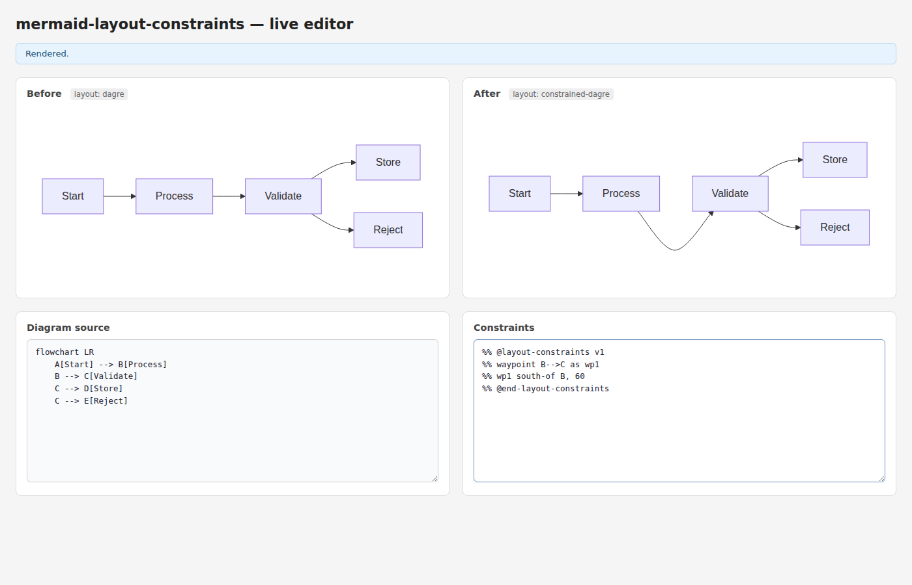
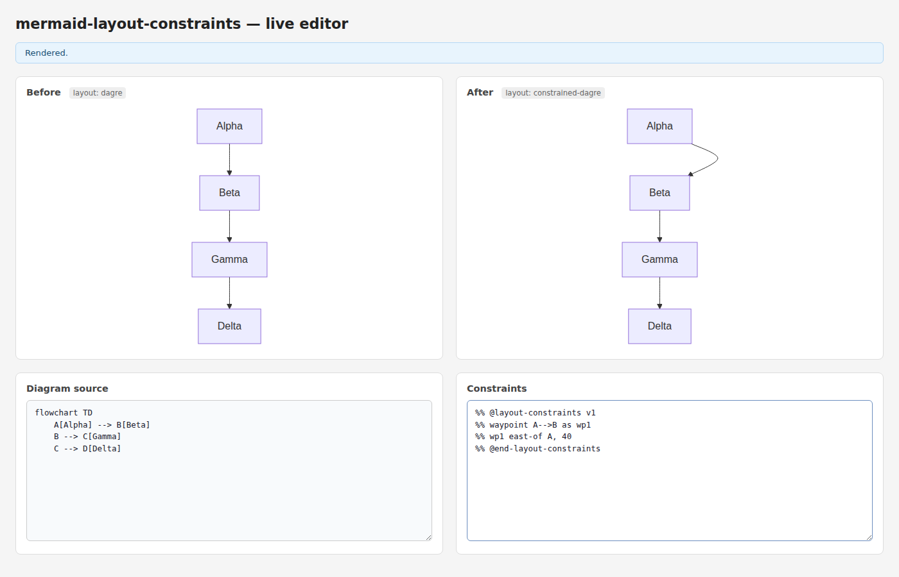

# Task 6: Edge Router — Waypoint-based edge routing

*2026-04-05T22:56:39Z by Showboat 0.6.1*
<!-- showboat-id: be546f1d-165c-4d19-93f8-3a34393c047e -->

Implements waypoint shadow nodes that route edges through constrained intermediate positions. Syntax: 'waypoint A-->B as wp1' declares a zero-size shadow node on an edge. The waypoint ID becomes a regular constraint target: 'wp1 south-of B, 60' routes the B→C edge through a position below B. Multiple waypoints per edge are supported, ordered by parse order.

Implementation: (1) buildWaypointNodes injects zero-size LayoutNodes at the edge midpoint as initial positions. (2) solveConstraints positions waypoints via the normal constraint system. (3) routeEdgesWithWaypoints builds a catmull-rom spline through exitPt → wp1 → ... → adjustedEntry. Edge labels are repositioned to the new geometric midpoint.

```bash
pnpm test -- --reporter=verbose 2>&1 | tail -30
```

```output

> mermaid-layout-constraints@0.1.0 test /home/user/mermaid-clamp
> vitest run -- --reporter=verbose


 RUN  v2.1.9 /home/user/mermaid-clamp

 ✓ src/parser/index.test.ts (33 tests) 26ms
 ✓ src/solver/index.test.ts (22 tests) 28ms
 ✓ src/serializer/index.test.ts (21 tests) 24ms
 ✓ src/index.test.ts (7 tests) 10ms
 ✓ src/layout/index.test.ts (39 tests) 52ms

 Test Files  5 passed (5)
      Tests  122 passed (122)
   Start at  22:56:44
   Duration  1.32s (transform 447ms, setup 0ms, collect 586ms, tests 140ms, environment 836ms, prepare 436ms)

```

```bash {image}
demos/task-06/task-06-01-baseline.png
```


```bash {image}
demos/task-06/task-06-02-waypoint-south-of-B.png
```



```bash {image}
demos/task-06/task-06-03-two-waypoints.png
```



All 122 tests pass. Waypoint routing is functional: edges are smoothly routed through constraint-positioned waypoints using catmull-rom splines converted to cubic bezier segments.
