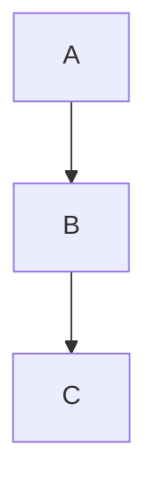

# Demo: Bezier Endpoint Clamping + `%% debug bezier`

## Task

Two improvements to bezier edge handling:

1. **Bezier endpoint clamping** — after `reanchorPath` similarity-transforms a dagre-generated bezier to fit new node positions, the first and last control points could exit/enter the node at odd angles. `clampEndpointHandles` fixes this by redirecting them along the true edge direction and capping their lengths to prevent bulging on short edges.

2. **`%% debug bezier` directive** — adds a visual overlay showing bezier control handles for ALL edges (dagre-generated + waypoint-routed), not just waypoint edges like the existing `debug` directive.

## Test Output

```
 ✓ src/parser/index.test.ts (48 tests)
 ✓ src/solver/index.test.ts (22 tests)
 ✓ src/serializer/index.test.ts (28 tests)
 ✓ src/index.test.ts (7 tests)
 ✓ src/layout/index.test.ts (50 tests)

 Test Files  5 passed (5)
      Tests  155 passed (155)
```

13 new tests added (5 parser, 8 layout).

## Changes

### `src/types.ts`
- Added `debugBezier?: boolean` to `ConstraintSet`

### `src/parser/index.ts`
- `%% debug bezier` anywhere in mermaid source → `debugBezier: true`
- `debug bezier` inside constraint block → same
- Both coexist with `debug` (waypoint-only overlay)

### `src/layout/index.ts`

**`clampEndpointHandles(d, exitPt, adjustedEntry)`** (exported, tested):
- Redirects cp1 of the first `C` command to exit along `exitPt → adjustedEntry`
- Redirects cp2 of the last `C` command to arrive along the same direction
- Caps both lengths at `edgeLen × 0.4` to prevent bulging on short/straight edges
- Returns `d` unchanged if there are no `C` commands or edge length ≈ 0

**`reRouteEdgesInSVG`**:
- After `reanchorPath`, now calls `clampEndpointHandles` before writing the `d` attribute

**`renderDebugOverlay(…, debugAllEdges?)`** (extended):
- New `debugAllEdges` param (passed as `cs.debugBezier`)
- When `true`: annotates ALL edges, not just waypoint-routed ones
- New `appendPathHandles(g, d, isWaypointEdge)` helper:
  - Blue dashed lines + blue dots for bezier control handles
  - Green anchor dots at on-curve points (dagre edges)
  - Orange anchor dots at on-curve points (waypoint edges)

**Render function**:
- Early-return guard now also checks `!cs.debugBezier`
- Passes `cs.debugBezier` to `renderDebugOverlay`

## Usage



Or inside a constraint block:

```
%% @layout-constraints v1
%% debug bezier
%% A south-of B, 60
%% @end-layout-constraints
```

## Status

Ready for human review.
