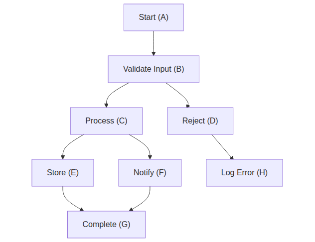
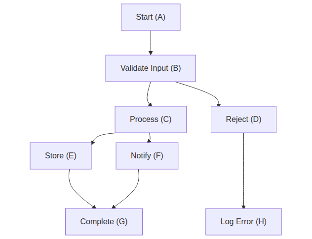
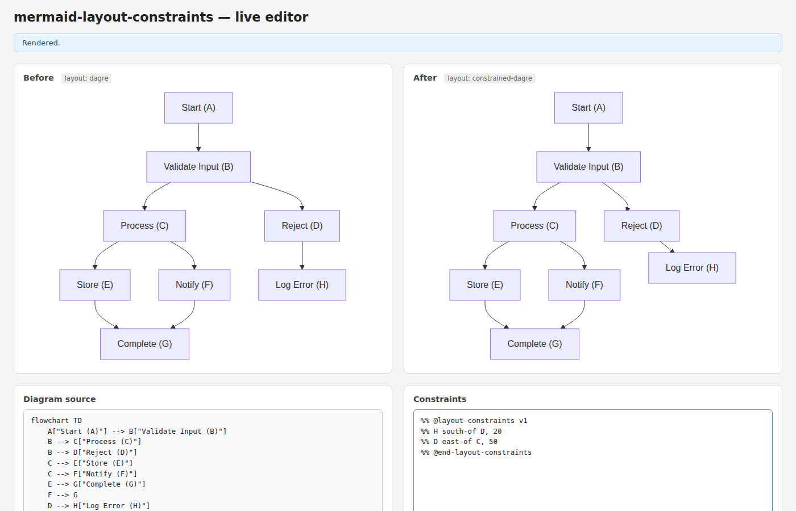

# Bug Fixes: BUG-1, BUG-2, BUG-3

*2026-04-05T22:41:00Z by Showboat 0.6.1*
<!-- showboat-id: 2ab0cf43-5ddd-4384-8e31-df14eaa55c1e -->

BUG-1: Curved arrows were replaced with straight lines after constraint solving. Root cause: reRouteEdgesInSVG used a linear-blend heuristic that distorted bezier control points. Fix: replaced with a 2D similarity transform (scale + rotate + translate) that maps oldStart→newStart and oldEnd→newEnd while preserving the exact bezier curve shape.

BUG-2: Directional constraints without explicit distance defaulted to 0 (nodes touching/overlapping). Fix: parser now defaults distance to 20px when omitted.

BUG-3: Cascade ordering — constraints like 'H south-of D' did not see D's new position from 'D east-of C'. Fix: topological sort (Kahn's algorithm) applied to directional constraints before relaxation, ensuring dependency order is respected in a single pass.

```bash
pnpm test -- --reporter=verbose 2>&1 | tail -60
```

```output

> mermaid-layout-constraints@0.1.0 test /home/user/mermaid-clamp
> vitest run -- --reporter=verbose


 RUN  v2.1.9 /home/user/mermaid-clamp

 ✓ src/parser/index.test.ts (33 tests) 15ms
 ✓ src/solver/index.test.ts (22 tests) 22ms
 ✓ src/serializer/index.test.ts (21 tests) 10ms
 ✓ src/index.test.ts (7 tests) 10ms
 ✓ src/layout/index.test.ts (26 tests) 51ms

 Test Files  5 passed (5)
      Tests  109 passed (109)
   Start at  22:41:11
   Duration  1.06s (transform 327ms, setup 0ms, collect 415ms, tests 108ms, environment 651ms, prepare 292ms)

```

```bash {image}
demos/bugs-01-curved-paths-before-constraint.png
```


```bash {image}
demos/bugs-01-curved-paths-after-constraint.png
```



```bash {image}
demos/bugs-01-curved-paths-full-constraints.png
```



```bash {image}
demos/bugs-02-default-distance-compare-viewport.png
```


```bash {image}
demos/bugs-03-cascade-viewport.png
```



All 109 tests pass. BUG-1 fix (similarity transform) replaces the previous linear-blend approach which caused kinks/zig-zags in the visual output. Screenshots confirm clean smooth curves matching dagre baseline quality.
