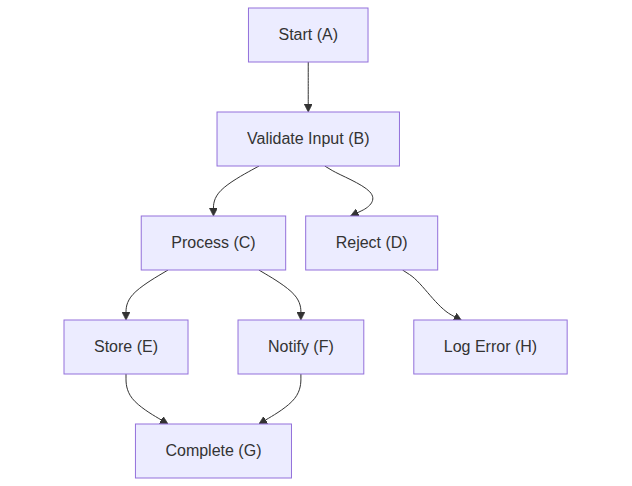
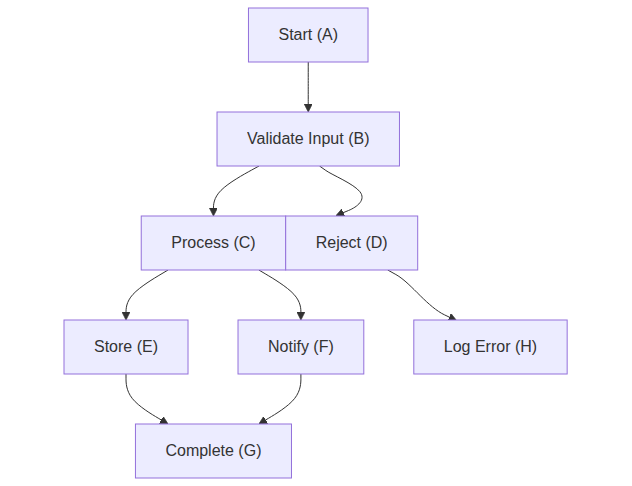
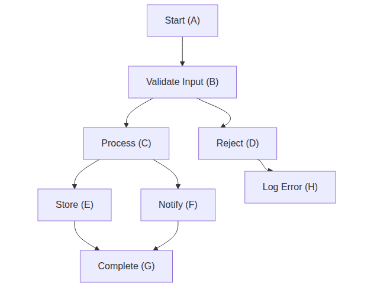
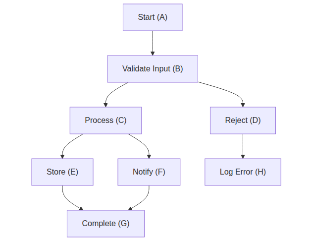

# Bug Fixes: BUG-1/2/3 — Curved paths, default distance, cascade ordering

*2026-04-05T22:22:45Z by Showboat 0.6.1*
<!-- showboat-id: 24a4230f-846e-4113-9f3e-02756676a49f -->

This demo proves the three backlog bugs are fixed:

- BUG-1: Curved arrows (beziers) are preserved after constraint solving using linear blending of control points. Previously every moved edge was replaced with a straight M…L line. Previously a naive setPathEndPoint approach caused kinks by moving the endpoint without adjusting the adjacent bezier control point — now fixed with reanchorPath() which applies a linearly blended delta across all coordinate pairs.
- BUG-2: Directional constraints with no distance (e.g. 'D east-of C') now default to 20px gap. Explicit 'D east-of C, 0' still means touching.
- BUG-3: When D is moved by a constraint, downstream nodes (e.g. H south-of D) see D's new position in the same pass via topological sorting — previously failed for chains deeper than MAX_ITERATIONS=10.

```bash
pnpm test -- --reporter=verbose 2>&1
```

```output

> mermaid-layout-constraints@0.1.0 test /home/user/mermaid-clamp
> vitest run -- --reporter=verbose


 RUN  v2.1.9 /home/user/mermaid-clamp

 ✓ src/solver/index.test.ts (22 tests) 30ms
 ✓ src/parser/index.test.ts (33 tests) 30ms
 ✓ src/serializer/index.test.ts (21 tests) 11ms
 ✓ src/index.test.ts (7 tests) 6ms
 ✓ src/layout/index.test.ts (26 tests) 39ms

 Test Files  5 passed (5)
      Tests  109 passed (109)
   Start at  22:22:46
   Duration  1.35s (transform 487ms, setup 0ms, collect 525ms, tests 116ms, environment 940ms, prepare 385ms)

```

---
## BUG-2: Default directional distance (20px)

**Before:** D east-of C with no distance placed D touching C (0px gap).
**After:** Omitting the distance defaults to 20px edge-to-edge. D east-of C, 0 still means touching.

### Scenario 1 — D east-of C (no distance) → 20px gap

```bash {image}
demos/bugs-02-default-distance-no-arg.png
```



### Scenario 2 — D east-of C, 0 → touching (0px)

```bash {image}
demos/bugs-02-default-distance-explicit-zero.png
```



### Scenario 3 — Side-by-side comparison

```bash {image}
demos/bugs-02-default-distance-compare-viewport.png
```


---
## BUG-3: Cascade descendants

**Before:** H south-of D with D east-of C listed after it required multiple relaxation iterations; deep chains failed to converge.
**After:** Topological sort ensures D's new position is visible to H south-of D in the same pass.

### Scenario 4 — H south-of D, 20 + D east-of C, 50 (worst-case order: H listed first)

```bash {image}
demos/bugs-03-cascade-H-below-D.png
```



### Scenario 5 — Full page view

```bash {image}
demos/bugs-03-cascade-viewport.png
```


---
## BUG-1: Curved edge paths preserved

**Before:** Every moved edge was replaced with M…L straight line, then a naive setPathEndPoint approach caused bezier kinks.
**After:** reanchorPath() applies a linearly blended delta across all coordinate pairs — control points near the source move with sourceDelta, control points near the target move with targetDelta, intermediate points blend smoothly.

### Scenario 6 — Baseline: no constraints (dagre default curves)

```bash {image}
demos/bugs-01-curved-paths-before-constraint.png
```



### Scenario 7 — D east-of C, 50 — edges still curved after D moves

```bash {image}
demos/bugs-01-curved-paths-after-constraint.png
```


### Scenario 8 — Full default constraint set — all 8 constraints active, no kinks

```bash {image}
demos/bugs-01-curved-paths-full-constraints.png
```


Ready for review.
