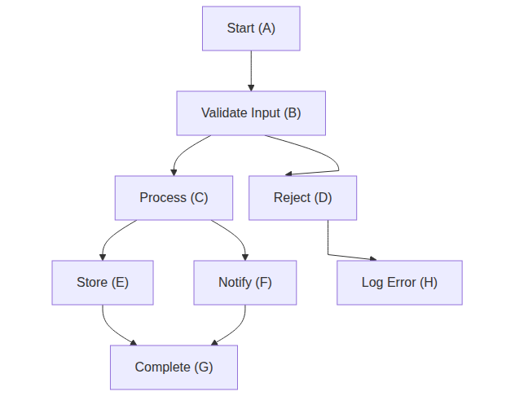
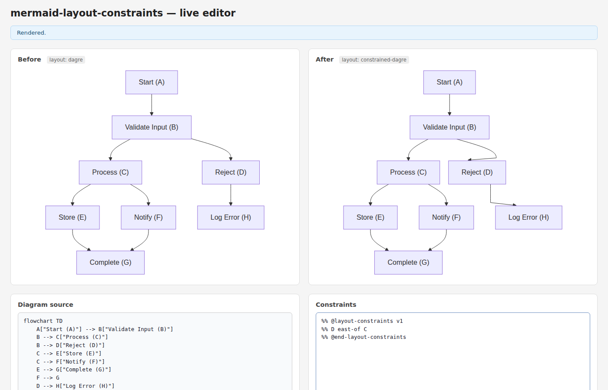
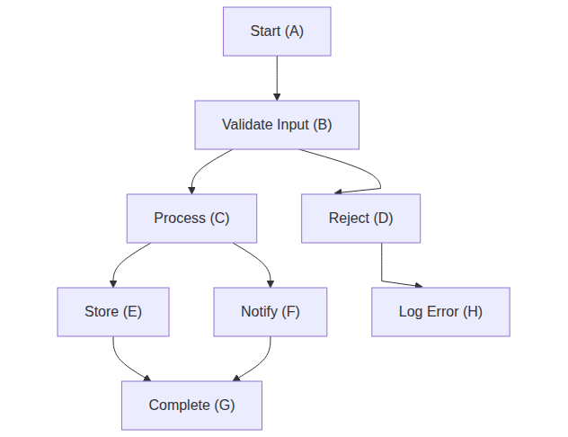
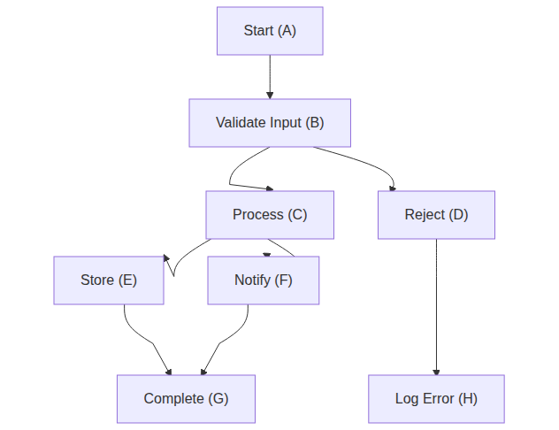

# Bug Fixes: BUG-1/2/3 — Curved paths, default distance, cascade ordering

*2026-04-05T19:13:01Z by Showboat 0.6.1*
<!-- showboat-id: 230d96cb-6704-45b8-97eb-2a0ccf7d74d5 -->

This demo proves the three backlog bugs are fixed:

- BUG-1: Curved arrows (beziers/arcs) are preserved after constraint solving — previously replaced with straight M…L lines.
- BUG-2: Directional constraints with no distance (e.g. 'D east-of C') now default to 20px gap. Explicit 'D east-of C, 0' still means touching.
- BUG-3: When D is moved by a constraint, downstream nodes (e.g. H south-of D) see D's new position in the same pass via topological sorting — previously required multiple relaxation iterations and failed for chains deeper than MAX_ITERATIONS=10.

```bash
pnpm test -- --reporter=verbose 2>&1
```

```output

> mermaid-layout-constraints@0.1.0 test /home/user/mermaid-clamp
> vitest run -- --reporter=verbose


 RUN  v2.1.9 /home/user/mermaid-clamp

 ✓ src/parser/index.test.ts (33 tests) 19ms
 ✓ src/solver/index.test.ts (22 tests) 33ms
 ✓ src/serializer/index.test.ts (21 tests) 19ms
 ✓ src/index.test.ts (7 tests) 11ms
 ✓ src/layout/index.test.ts (26 tests) 49ms

 Test Files  5 passed (5)
      Tests  109 passed (109)
   Start at  19:13:13
   Duration  1.98s (transform 369ms, setup 0ms, collect 590ms, tests 131ms, environment 1.44s, prepare 447ms)

```

---
## BUG-2: Default directional distance (20px)

**Before:** D east-of C with no distance placed D touching C (0px gap).
**After:** Omitting the distance defaults to 20px edge-to-edge. D east-of C, 0 still means touching.

### Scenario 1 — D east-of C (no distance) → 20px gap
Constraint: `D east-of C`

```bash {image}
demos/bugs-02-default-distance-no-arg.png
```



### Scenario 2 — D east-of C, 0 → touching (0px)
Constraint: `D east-of C, 0`

```bash {image}
demos/bugs-02-default-distance-explicit-zero.png
```


### Scenario 3 — Side-by-side comparison
Left: dagre default (no constraints). Right: constrained-dagre with D east-of C.

```bash {image}
demos/bugs-02-default-distance-compare-viewport.png
```



---
## BUG-3: Cascade descendants via topological sort

**Before:** H south-of D + D east-of C required multiple relaxation iterations; chains longer than MAX_ITERATIONS=10 never converged.
**After:** Directional constraints are topologically sorted before the relaxation loop so that D's new position is visible to H south-of D in the same pass.

### Scenario 4 — H south-of D, 20 + D east-of C, 50 (worst-case order)
H is listed BEFORE D east-of C — previously H would use D's OLD position.
H must be below D's NEW (eastward-moved) position.

```bash {image}
demos/bugs-03-cascade-H-below-D.png
```


### Scenario 5 — Full-page view

```bash {image}
demos/bugs-03-cascade-viewport.png
```


---
## BUG-1: Curved edge paths preserved

**Before:** After constraint solving, every moved edge path was replaced with a straight M…L line, discarding mermaid's bezier/arc curves.
**After:** The existing SVG path is translated by the source attachment-point delta. The curve shape is preserved; only the start/end attachment points change.

### Scenario 6 — Baseline: no constraints (dagre default curves)
Shows mermaid's default curved edges before any constraints are applied.

```bash {image}
demos/bugs-01-curved-paths-before-constraint.png
```


### Scenario 7 — After constraint solving (D east-of C, 50)
D moves right. Edges connecting to D should remain curved — previously they became straight lines.

```bash {image}
demos/bugs-01-curved-paths-after-constraint.png
```



### Scenario 8 — Full default constraint set
All 8 constraints active. All edges must remain curved after solving.

```bash {image}
demos/bugs-01-curved-paths-full-constraints.png
```



Ready for review.
