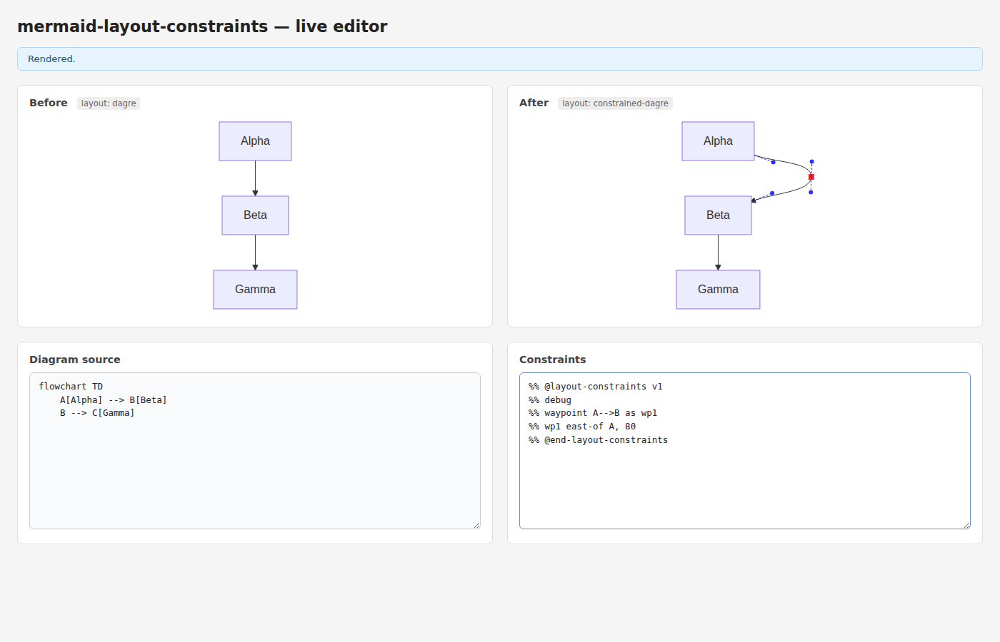
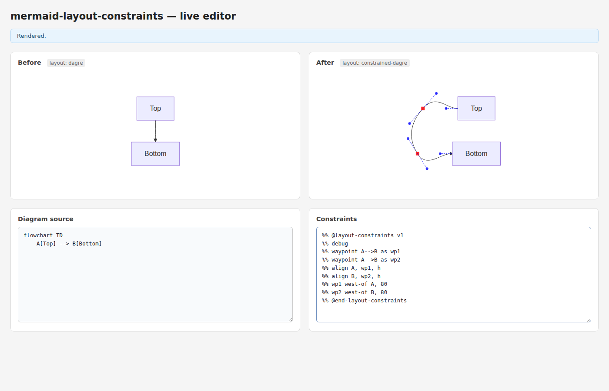
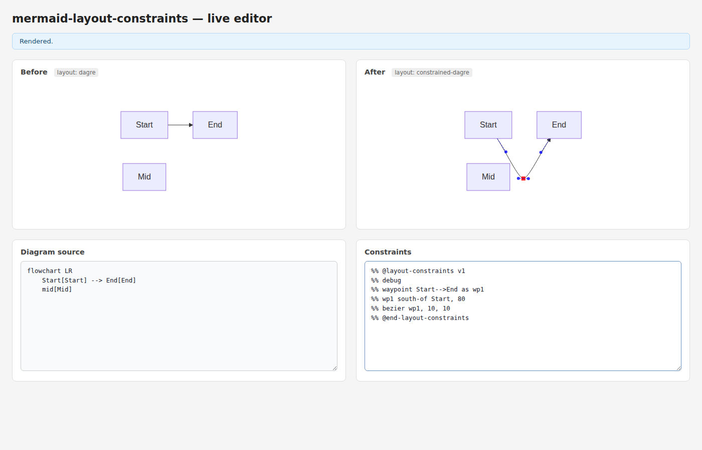
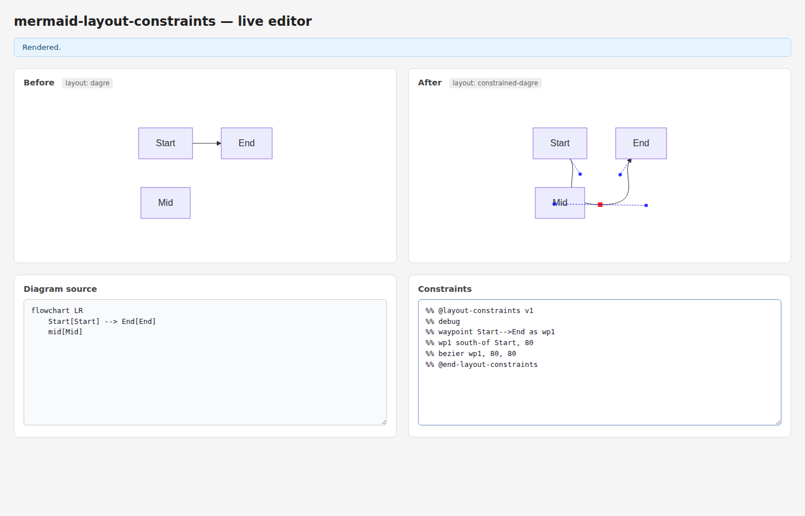
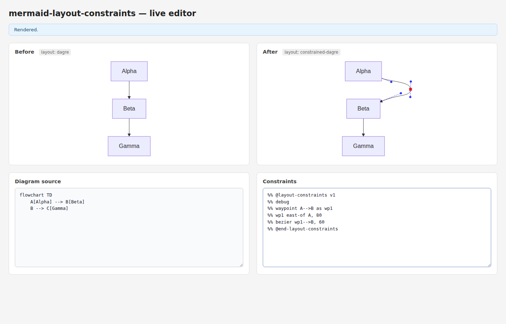
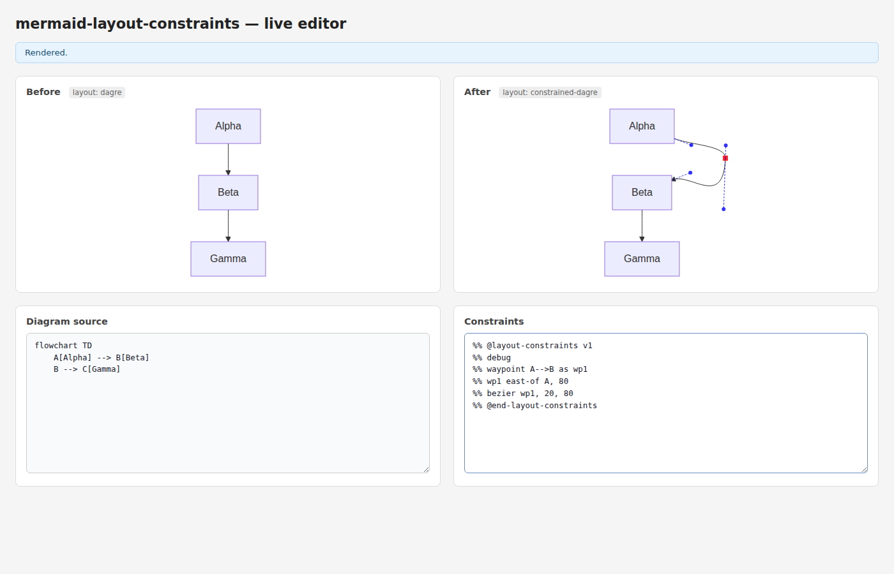
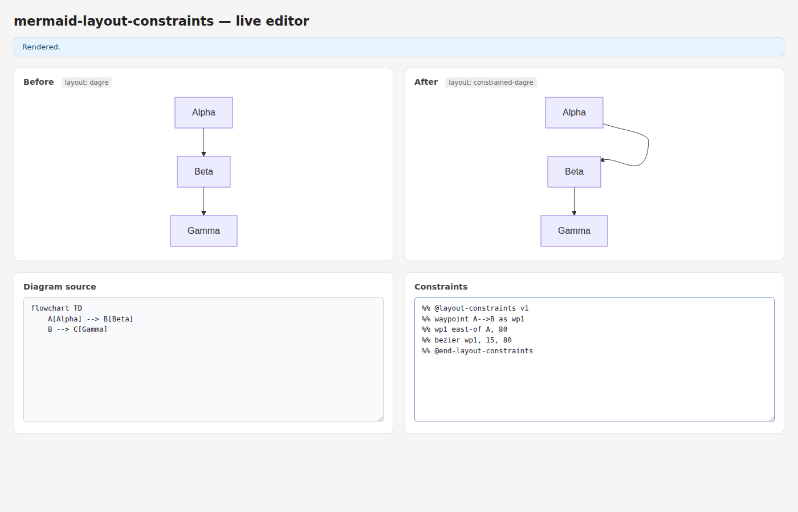

# Debug Overlay and Bezier Handle Length Control

Implements two developer/author features for working with waypoint-routed edges:

1. **`%% debug` directive** — renders a visual overlay on the constrained diagram showing each waypoint as a red square and each bezier control handle as a blue dashed line with a dot at the tip.

2. **`bezier` constraint** — overrides the pixel length of bezier spline handles at waypoints or boundary edge segments. The catmull-rom tangent direction is always preserved; only the handle length changes.

## Test output

```
 ✓ src/parser/index.test.ts (43 tests)
 ✓ src/solver/index.test.ts (22 tests)
 ✓ src/serializer/index.test.ts (28 tests)
 ✓ src/index.test.ts (7 tests)
 ✓ src/layout/index.test.ts (42 tests)

 Test Files  5 passed (5)
      Tests  142 passed (142)
```

---

## Key implementation facts

| Behaviour | Detail |
|-----------|--------|
| `debug` directive | Standalone `%% debug` line inside the constraint block; sets `ConstraintSet.debug = true` |
| Debug overlay element | `<g id="__clamp-debug" pointer-events="none">` appended to SVG; replaced on each re-render |
| Waypoint marker | Red `<rect>` 8×8 px centered at waypoint position |
| Handle visualisation | Blue dashed `<line>` from each spline anchor to its control point; blue `<circle>` (r=3) at handle tip |
| `bezier` waypoint form | `bezier <wpId>, <inLen> [, <outLen>]` — overrides incoming and/or outgoing handle length |
| `bezier` segment form | `bezier <src>--><tgt>, <len>` — overrides handle at the real-node end of a boundary segment |
| Direction preserved | Catmull-rom tangent direction is always kept; only the scalar length is replaced |
| Round-trip safe | `bezier` serializes deterministically and re-parses to the same constraint |

---

## Scenario 1 — Debug: single waypoint with east detour

```
waypoint A-->B as wp1
wp1 east-of A, 80
```

The red square marks wp1. Two pairs of blue handle lines are visible: one pair on either side of the waypoint, one pair at each end of the edge.



---

## Scenario 2 — Debug: two waypoints forming a C-shape

```
debug
waypoint A-->B as wp1
waypoint A-->B as wp2
align A, wp1, h
align B, wp2, h
wp1 west-of A, 80
wp2 west-of B, 80
```

Both waypoints are marked with red squares. All four bezier handles of the two spline segments are shown in blue.



---

## Scenario 3 — Bezier: tight handles (10 px)

```
debug
waypoint Start-->End as wp1
wp1 south-of Start, 80
bezier wp1, 10, 10
```

With 10 px handles at wp1 the segments are nearly straight — tight V-shape with minimal curvature near the waypoint. Compare the blue handle stubs to the default tension (≈ 33–67 px depending on geometry).



---

## Scenario 4 — Bezier: long handles (80 px)

```
debug
waypoint Start-->End as wp1
wp1 south-of Start, 80
bezier wp1, 80, 80
```

With 80 px handles at wp1 the segments curve smoothly far from the waypoint, producing a pronounced S-shape. The long dashed blue lines show the extended control handles.



---

## Scenario 5 — Bezier segment form: outgoing handle at source (`A-->wp1`)

```
debug
waypoint A-->B as wp1
wp1 east-of A, 80
bezier A-->wp1, 60
```

`bezier A-->wp1, 60` sets the outgoing handle length at the source node (Alpha's exit point) to 60 px. The handle on the A side of the curve is longer than default while the wp1 side remains catmull-rom.


---

## Scenario 6 — Bezier segment form: incoming handle at target (`wp1-->B`)

```
debug
waypoint A-->B as wp1
wp1 east-of A, 80
bezier wp1-->B, 60
```

`bezier wp1-->B, 60` sets the incoming handle length at the target node (Beta's entry point) to 60 px. The B-side handle is overridden while A-side and wp1 remain catmull-rom.



---

## Scenario 7 — Bezier: asymmetric handles at waypoint (20 in, 80 out)

```
debug
waypoint A-->B as wp1
wp1 east-of A, 80
bezier wp1, 20, 80
```

`bezier wp1, 20, 80` gives wp1 a tight incoming handle (20 px) and a long outgoing handle (80 px). The asymmetry is visible in the debug view: one handle stub is short, the other long.



---

## Scenario 8 — Bezier without debug (clean output)

```
waypoint A-->B as wp1
wp1 east-of A, 80
bezier wp1, 15, 80
```

The same constraint without `%% debug` produces a clean SVG with no overlay. The curve shape still reflects the asymmetric handles; the debug `<g>` element is simply absent.


